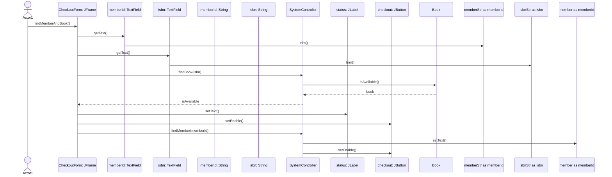
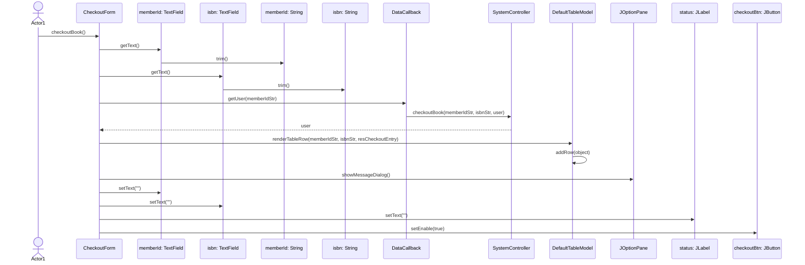

# LibraryApplication

## Find Member And Book

```mermaid
sequenceDiagram
    actor Actor1
    participant CheckoutForm as CheckoutForm: JFrame
    participant memberId as memberId: TextField
    participant isbn as isbn: TextField
    participant memberStr as memberId: String
    participant isbnStr as isbn: String
    participant SystemController
    participant status as status: JLabel
    participant checkoutBtn as checkout: JButton
    participant Book

    Actor1 ->> CheckoutForm: findMemberAndBook()
    CheckoutForm ->> memberId: getText()
    memberId ->> memberStr as memberId: trim()
    CheckoutForm ->> isbn: getText()
    isbn ->> isbnStr as isbn: trim()
    CheckoutForm ->> SystemController: findBook(isbn)
    SystemController ->> Book: isAvailable()
    Book -->> SystemController: book
    SystemController -->> CheckoutForm: isAvailable
    CheckoutForm ->> status: setText()
    CheckoutForm ->> checkoutBtn: setEnable()
    CheckoutForm ->> SystemController: findMember(memberId)
    SystemController ->> member as memberId: setText()
    SystemController ->> checkoutBtn: setEnable()
```

## Checkout Book

```mermaid
sequenceDiagram
    actor Actor1
    participant CheckoutForm
    participant memberId as memberId: TextField
    participant isbn as isbn: TextField
    participant memberIdStr as memberId: String
    participant isbnStr as isbn: String
    participant DataCallback
    participant SystemController
    participant DefaultTableModel
    participant JOptionPane
    participant status as status: JLabel
    participant checkoutBtn as checkoutBtn: JButton

    Actor1 ->> CheckoutForm: checkoutBook()
    CheckoutForm ->> memberId: getText()
    memberId ->> memberIdStr: trim()
    CheckoutForm ->> isbn: getText()
    isbn ->> isbnStr: trim()
    CheckoutForm ->> DataCallback: getUser(memberIdStr)
    DataCallback ->> SystemController: checkoutBook(memberIdStr, isbnStr, user)
    SystemController -->> CheckoutForm: user
    
    CheckoutForm ->> DefaultTableModel: renderTableRow(memberIdStr, isbnStr, resCheckoutEntry)
    DefaultTableModel ->> DefaultTableModel: addRow(object)
    CheckoutForm ->> JOptionPane: showMessageDialog()
    
    CheckoutForm ->> memberId: setText("")
    CheckoutForm ->> isbn: setText("")
    CheckoutForm ->> status: setText("")
    CheckoutForm ->> checkoutBtn: setEnable(true)
```
